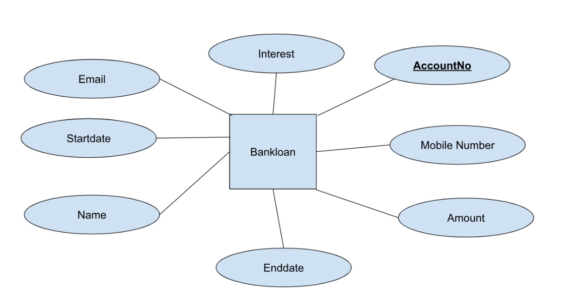

# Ex02 Django ORM Web Application
## Date: 28/10/24

## AIM
To develop a Django application to store and retrieve data from a bank loan database using Object Relational Mapping(ORM).

## ENTITY RELATIONSHIP DIAGRAM



## DESIGN STEPS

### STEP 1:
Clone the problem from GitHub

### STEP 2:
Create a new app in Django project

### STEP 3:
Enter the code for admin.py and models.py

### STEP 4:
Execute Django admin and create details for 10 books

## PROGRAM
```
admin.py
from django.contrib import admin
from .models import bankloan,bankloanAdmin
admin.site.register(bankloan,bankloanAdmin)

models.py
from django.db import models
from django.contrib import admin
class bankloan(models.Model):
	Name=models.CharField(max_length=10)
	Accountno=models.IntegerField(primary_key="Accountno")
	Interest=models.FloatField()
	Startdate=models.DateField()
	Email=models.EmailField()
	Mobilenumber=models.IntegerField()
	Amount=models.IntegerField()
	Enddate=models.DateField()

class bankloanAdmin(admin.ModelAdmin):
	list_display=('Name','Accountno','Interest','Startdate','Email','Mobilenumber','Amount','Enddate')

```


## OUTPUT

.png>)


## RESULT
Thus the program for creating a database using ORM hass been executed successfully
